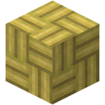
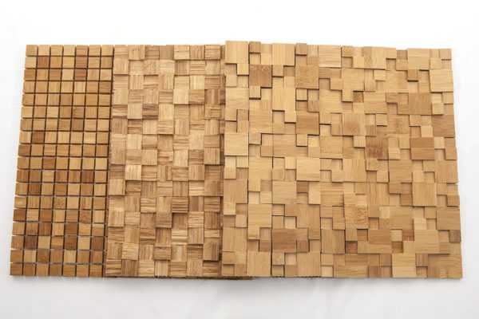
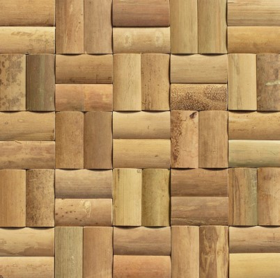
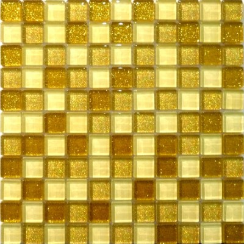

# 方块

## Chiseled

### **名词释义**

剑桥词典对 chisel 的解释是“a tool with a long metal blade that has a sharp edge for cutting wood, stone, etc”，通常对应汉语名词“凿子”、“錾子”。根据百度百科的资料，“凿子”可以指代加工石头、木头、金属或其他材料的凿子，而“錾子”仅指代加工石头或金属的小凿子，所以“錾制”只能用在石质或者金属方块上。

同时 chiseled 除了“凿刻的”还有“轮廓分明的”意思，不过“轮廓分明的石砖（chiseled stone brick）”和“轮廓分明的书架（chiseled bookshelf）”都很奇怪，所以不考虑这样翻译。

对于新方块“雕纹书架（chiseled bookshelf）”中“雕”这种加工方式，百科给出的解释是“在竹木、玉石、金属等上面刻画”。

### **讨论**

“雕”既可以用在木质材料上，也可以用在石质材料上，并且比“凿”听起来更优雅**[有待考证]**，使用“雕纹”来修饰木质或者石质方块都是没有问题的；“錾”只能用在石质材料加工上，用“錾制”修饰石质方块也没有问题。“錾制”作为 Minecraft Wiki 译名标准化有历史记录（1.8）以来一直使用的译名，没有必要为了一个新方块就全面弃用。更何况 chiseled bookshelf 的合成方式与各种錾制石块不同，可见 Mojang 在设计时并没有考虑将 chiseled bookshelf 列入“錾制”一类，使用“chiseled”只是一词多义的体现。

至于“錾”是生僻字的说法，我很难赞同。“錾”的Unicode变换是\u933E，收录在《通用规范汉字表》（2013年）37页第3列第6079号，属于二级字表的内容。此外，二级字表中有很多挺常见的字，如编号6076的是“甘霖”的“霖”，编号6077是“细雨霏霏”的“霏”，编号6078的是“霓虹”的“霓”。无论按照Unicode范围（一般认为Unicode `\u4e00-\u9fa5` 外为生僻字）还是《通用规范汉字表》的收录标准来说，充其量只是个不常用字罢了。

另外，因为投票选项设置不合理的问题，该译名的投票在 MCBBS 官方帐号的动态里发布了两次，在两次投票参与人数相近的情况下，投票结果出现了很大的分歧，让人很难不怀疑投票统计存在样本选择偏差。

### **引用**

- [Minecraft 1.20游戏新内容简体中文译名公示 1](https://t.bilibili.com/721741070699855877)
- [Minecraft 1.20游戏新内容简体中文译名公示 2](https://www.bilibili.com/opus/721741070699855877)
- [Chiseled Bookshelf 中文译名意见征集 - 旧](https://www.bilibili.com/opus/719720645071470693)
- [Chiseled Bookshelf 中文译名意见征集 - 新](https://www.bilibili.com/opus/719444414236196889)
- [凿子_百度百科](https://baike.baidu.com/item/%E5%87%BF%E5%AD%90)
- [錾子_百度百科](https://baike.baidu.com/item/%E9%8C%BE%E5%AD%90)
- [雕刻_百度百科](https://baike.baidu.com/item/%E9%9B%95%E5%88%BB)
- [Minecraft Wiki:译名标准化/历史](https://minecraft.fandom.com/zh/wiki/Minecraft_Wiki:%E8%AF%91%E5%90%8D%E6%A0%87%E5%87%86%E5%8C%96/%E5%8E%86%E5%8F%B2)
- [如何判断一个字是生僻字还是常用字？ - 西东的回答 - 知乎](https://www.zhihu.com/question/468854714/answer/1975728391)
- [通用规范汉字表](http://www.moe.gov.cn/jyb_sjzl/ziliao/A19/201306/t20130601_186002.html)
- [Word 版《通用规范汉字表》全 8105 字 - 知乎](https://zhuanlan.zhihu.com/p/109593054)

## Bamboo Mosaic

### **为什么不喜欢“竹马赛克”译名**

1. “竹马赛克”使用了音译词，放在中文译名中总有一股机翻的感觉，虽然“苦力怕”、“史莱姆”也是音译，但是它在现实中并没有对应的事物，使用音译并不显得奇怪；
2. MCBBS 官方发布的投票动态中对于行业标准的描述存在明显错误，如 [Bamboo Mosaic 译名讨论中涉及行业标准的错误](https://tieba.baidu.com/p/8097391672) 所述，它在引用名称、引用内容和对标准的使用方式上都存在错误。虽然该标准对翻译有一定参考价值，但一切应以游戏实际情况为准。

> 一、该标准的名称为《竹马赛克LY/T 3277-2021》而非《中国林业行业标准》ICS 79.020 B67。
> 
> 中国林业行业标准（CN-LY）为该标准发布单位，不是标准名。ICS 79.020 B67更不是标准号。ICS 79.020意为国际标准分类法、木材技术 - 木材加工技术。B67意为中国标准文献分类法、农业、林业 - 林业 - 原竹与竹材。
> 
> 这是最基本的标准文件格式问题。标准格式为标准名-标准号-标准年份，竹马赛克支持者在各大平台四处转发所谓的《中国林业行业标准》，竟无一人注意到该问题，充分说明竹马塞克支持者根本不曾接触建筑及室内设计相关行业。其对于有误的信息不加思索地加以扩散，展露了其令人担忧的判断信息真伪的能力。
> 
> **……**
>
> 二、我的世界中文论坛引用的标准图为没有标准号的报批稿。其动态中引用竹马赛克的定义为“由若干小竹块经衬材拼贴而成的竹质墙面装饰材”，这也是报批稿中采用的表述（LY/T 3277-2021 定义的竹马赛克为“由若干小竹块经衬材拼贴而成的竹质墙面装饰材**料**）。
> 
> 令人啼笑皆非的是，为了避免观众发现其引用的是报批版本，其在截图时将封面拦腰截断，删减了含有报批稿三个字的下半部分。
> 
> **……**
> 
> 三、LY/T 3277-2021提出：“本文件规定了竹马赛克的术语和定义、要求、试验方法、检验规则以及标志、包装、运输和贮存。本文件适用于竹条或竹集成材为主要原料制造的墙面装饰材料。”
> 
> 人家写标准是为了告诉你现实生活中哪些物品属于《竹马赛克 LY/T 3277-2021》的管辖范围，并且告诉你竹马赛克制品该怎么试验、检验以及标志、包装、运输和贮存。不是告诉你见到 Mosaic 就翻译成马赛克就行了。
> 
> 按照竹马赛克支持者万物翻译抄 LY/T 3277-2021 的理论，竹嵌纹（花叶）病毒（Bamboo mosaic virus）应该翻译成竹马赛克病毒。著名的烟草花叶病毒（tobacco mosaic virus）应该翻译成烟草马赛克病毒。

### **Bambooc Mosaic 是个什么**

Mojang 给 bamboo mosaic 绘制的纹理相当奇怪，看上去既像拼接成的，又像编织的，从纹理上并不能很直观地判断这是什么方块。MCBBS 在投票中仅给出了游戏中方块的纹理和 bamboo mosaic 在`LY/T 3277-2021`中的术语定义，然而单凭文字是很难想象出如此奇怪的方块在现实中的样子的，所以接下来几段会对 bamboo mosaic 的来源作简单考证。

根据 bamboo mosaic 的合成表，需要两块竹半砖合成 bamboo mosaic，这与所有錾制类的石质方块的合成方式是类似的，说明 Mojang 给这个方块的定位是“具有比较复杂外观的竹制方块”（~~Mojang 没把它命名为 chiseled bamboo plank 我不是很认可 `XP`~~）；由竹板/竹半砖而来的合成方式又说明了这个方块不可能是编织而成的，假如把竹半砖理解成小块竹子，bamboo mosaic 应该是由小块竹子组合而成的方块。

使用 Bing 图片搜索“竹马赛克”得到的相关内容很少，是锦砖、竹制品、“竹马赛克”等各种图片混杂；而搜索“bamboo mosaic”得到的几乎都是由竹块镶嵌、拼贴制作的竹制品的图片。这说明“竹马赛克”一词在汉语中并不常见，在英文语境下更常见，bamboo mosaic 很可能是竹这种材料流传到西方之后，在西方产生的建筑材料。搜索得到的 bamboo mosaic 外形主要有以下两种：

可以发现 Mojang 在纹理中描绘的 bamboo mosaic 应该和第二种类似，这个样式和常见的“马赛克”差距很大，不知道 Mojang 为何选择这个：

### **合适的译名**

- 投票候选译名中还有“竹铺贴板”、“花纹竹板”两个译名，前者强调了 bamboo mosaic 工艺方面的拼贴特征，后者强调了方块外观设计上的复杂花纹特征；
- 建筑材料方面的“马赛克”，或者“马赛克瓷砖”，还被称为“锦砖”，让译名与“锦砖”靠近也是一个方向，如“竹锦板”，“竹锦块”；
- 在科学领域有不少 mosaic 相关的翻译，如：
  - [生物医学] tobacco mosaic virus: 烟草花叶病毒；
  - [生物医学] cucumber mosaic virus: 黄瓜花叶病毒，胡瓜嵌纹病毒；
  - [地球科学] mosaic imaging: 镶嵌成象；
  - [电子信息] mosaic filter: 镶嵌滤波器。  
  可见许多翻译都将 mosaic 与“镶嵌”一词联系，据此也可以将 bamboo mosaic 翻译成“镶嵌竹板”、“竹嵌板”、“嵌花竹板”等，强调拼贴工艺也可以翻译成“拼贴竹板”、“拼花竹板”。

最后选择了“拼花竹板”。

### **参考**

- [Bamboo Mosaic 中文译名意见征集](https://www.bilibili.com/opus/718781868286148609)
- [Bamboo Mosaic 译名讨论中涉及行业标准的错误【minecraft吧】_百度贴吧](https://tieba.baidu.com/p/8097391672)
- [竹马赛克这个词有什么难理解的【minecraft吧】_百度贴吧](https://tieba.baidu.com/p/8096200192)
- [“竹马赛克”既不方便，也不正确【minecraft吧】_百度贴吧](https://tieba.baidu.com/p/8096871712)
- [The Bamboo Mosaic BM-006 - bamboo-mosaic.com](https://bamboo-mosaic.com/?page_id=215)
- [BAMBOO MOSAIC - materialdistrict.com](https://materialdistrict.com/material/bamboo-mosaic/)
- [【mosaic】的中文翻译和相关专业术语翻译-SCIdict学术词典](http://www.scidict.org/items/mosaic.html)

## Moss Carpet

*地毯的碰撞箱是 16 × 1 × 16，moss carpet 的碰撞箱是 16 × 1 × 16* 
*地毯用两个同色羊毛合成，moss carpet 用两个苔藓块合成* 
*地毯能放在水上、地毯上、b36上，moss carpet 能放在水上、moss carpet上、b36上* 
*WoolCarpetBlock extends CarpetBlock，MOSS_CARPET is instanceof CarpetBlock*

~~*综上，moss carpet就应该叫苔藓地毯*~~

### **名词释义**

根据剑桥词典，carpet 的名词解释有如下两种：“a woven floor covering”和“a thick covering of sth”，前者就是地毯的意思，后者可解释为“厚的（某种）覆盖物”或“覆盖地面的一层厚东西”。

### **语序的统一性**

观察方块的中文译名，不难发现译名具有`[外观描述词][材料描述词][形状描述词]`这样的格式，例如：

- 铁块：`铁 | 块`
- 白桦木楼梯：`白桦 | 木 | 楼梯` 或 `白桦木 | 楼梯`
- 锈蚀的涂蜡切制铜台阶：`锈蚀的 涂蜡 切制 | 铜 | 台阶`

个人认为中文译名的语序没必要严格按照英文名来，毕竟中文和英文的语序客观存在差异，例如“long red hair”的中文表述是“红色的长发”。但是中文译名本身需要有统一的格式，如前文所述。这条规则同样适用于前面 bamboo mosaic 的翻译：虽然 bamboo mosaic 相比 bamboo planks 改变了 bamboo 后面的词，但是同样由半砖合成的 chiseled quartz block 相比 quartz block 前面多了 chiseled，中文译名在前面增加了“錾制”，并且两者都是在原方块的基础上改变了外观。为了保证“上下两个半砖合成的方块”和“只改变了方块外观，没有改变方块外形”在翻译上体现出的统一性，候选词就被限制在“xx竹板”的格式下了。

同理，moss carpet 相对于 moss block 改变的是后方的词，外形由整个方块变为了与地毯相同的形状，合成表与合成地毯的形式完全相同，那么 moss carpet 的译名即便不采用“苔藓地毯”也该是“苔藓xx”，而不是“覆地苔藓”。
